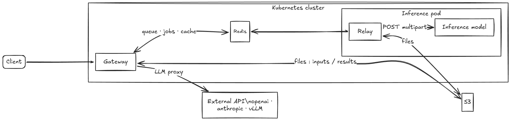

# Architecture overview

GatewAI consists of two independent components deployed separately:

- **Gateway** — HTTP server that accepts requests, routes them, and returns results
- **Relay** — standalone Kubernetes Deployment alongside the inference pod; one pod per job lifecycle

## Infrastructure dependencies

## Component responsibilities

### Gateway

- Accepts HTTP requests from clients
- Routes to the correct service based on `service_type`, `model`, and path
- Enforces per-consumer, per-service rate limits (Redis fixed-window)
- Uploads input files to S3
- Persists job records in Redis (configurable TTL per status via `lifecycle.job_ttl`)
- Pushes the job ID to `relay:<model>:pending` (RPUSH, or LPUSH for priority jobs)
- Subscribes to `jobs:<model>:completed` (Redis pub/sub) to detect relay completion
- Notifies clients: updates Redis record and triggers webhook if `callback_url` set
- Proxies sync requests directly to `inference_url`
- LLM proxy for JSON requests: provider translation, response caching, consumer token tracking

### Relay

- Runs as a separate container in the inference Deployment (not a sidecar)
- Waits for the local inference service to be ready (`/health` poll)
- Pops one job from `relay:<model>:pending` via `BLMOVE LEFT RIGHT` (moves it to `relay:<model>:processing`)
- Subscribes to `relay:<model>:cancel` before reading the job to avoid a cancel-race window
- Downloads input from S3
- Calls the local inference model
- Uploads result to S3
- Publishes to `jobs:<model>:completed` (Redis pub/sub) and removes job from the processing list
- **One job per pod lifecycle** — the pod exits (code 0) after processing; KEDA creates a fresh pod for the next job
- Scaled by KEDA on Redis list length (`relay:<model>:pending`), `minReplicaCount: 0`

## Data flow

See [Request flows](request-flows.md) for detailed sequence diagrams for each mode.

## Service registry

The gateway is entirely config-driven. See [Service registry](service-registry.md).

## LLM proxy

JSON requests to services with `provider` set go through a built-in LLM proxy with provider translation (OpenAI ↔ Anthropic), response caching, and consumer metrics. See [LLM proxy](llm-proxy.md).

## Rate limiting

Per-consumer fixed-window rate limiting across all request modes. See [Rate limiting](rate-limiting.md).
