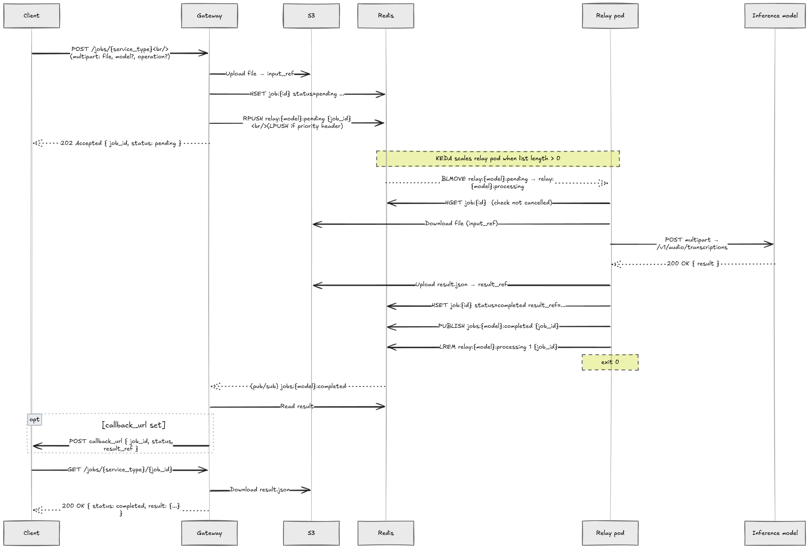
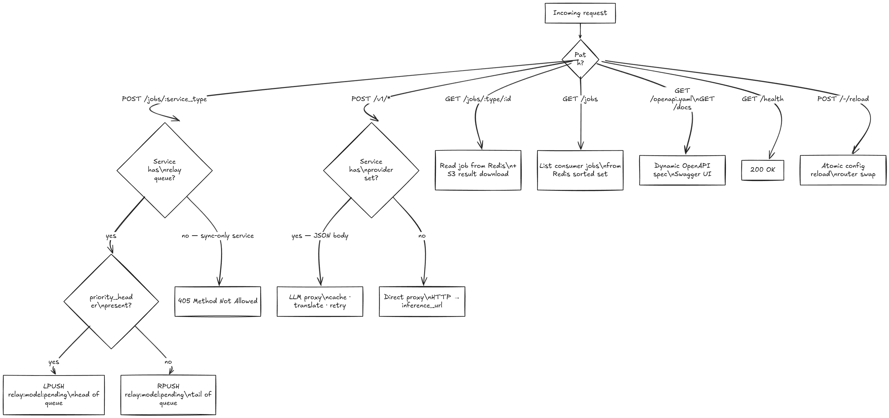

# Request flows

## Async mode

`POST /jobs/{service_type}` — fire and forget, poll for result.



**Priority path:** when `server.priority_header` is set and the header is present in the request, `LPUSH` est utilisé à la place de `RPUSH` — le job atterrit en tête de queue et est traité en premier par le prochain pod relay.

**Client polling:**

```
GET /jobs/{service_type}/{job_id}
→ { status: "pending" | "processing" | "completed" | "failed", result: {...} }
```

---

## Sync direct proxy mode

`POST /v1/*` — any content type (JSON or multipart).

```
Client
  │  POST /v1/audio/transcriptions
  │  { "model": "whisper-large-v3", ... }
  ▼
Gateway
  └── HTTP proxy ──────────────────────────────► InferenceService
                                                 (inference_url + original path)
                                                          │
                                                          ▼
                                                 Response proxied back
```

---

## LLM proxy mode

`POST /v1/*` with JSON body on a service with `provider` set.

```
Client
  │  POST /v1/chat/completions  {"model": "my-alias", ...}
  ▼
Gateway — LLM proxy
  ├── Cache lookup  ──────────────────── Redis  SHA-256(canonical body)
  │    HIT  → return cached response  X-Cache: HIT
  │    MISS ↓
  ├── Select backend (weighted-random)
  ├── Translate request (if anthropic: OpenAI → Messages API)
  ├── Forward to backend  ───────────► backend URL
  │    5xx/net error → retry next backend
  │    4xx → stop
  ├── Translate response → OpenAI format
  ├── Track consumer tokens  ────────► Redis  sorted set
  ├── Write response to client  X-Cache: MISS
  └── Async cache-fill (5 s timeout) ► Redis

Streaming (stream: true): SSE piped directly, no cache, no translation.
```

---

## Routing decision


